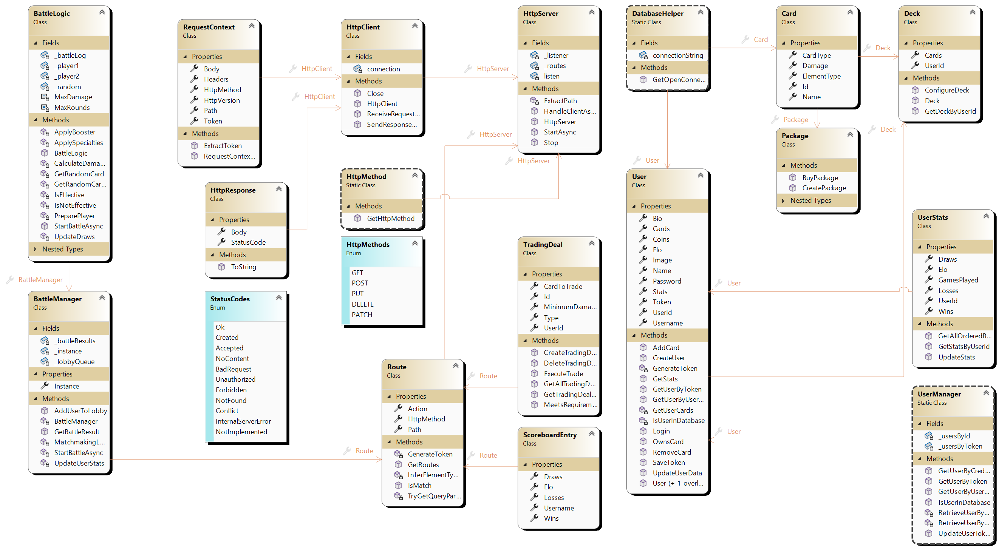

# Protokolldokument Monster Trading Cards Game (MTCG)

## Projektübersicht
Das Monster Trading Cards Game (MTCG) ist eine REST-basierte Serveranwendung, die es Benutzern ermöglicht, sich zu registrieren, anzumelden, Karten zu verwalten, Decks zu definieren, gegen andere Benutzer zu kämpfen, Statistiken zu vergleichen und Karten zu tauschen. Der Server wurde mit C# und .NET 8 entwickelt, wobei die Daten in einer PostgreSQL-Datenbank gespeichert werden. Das Projekt umfasst eine umfassende Reihe von Unit-Tests, um die Funktionalität der Anwendung zu überprüfen.

## Designentscheidungen
### HTTP-Server
- Implementierung eines benutzerdefinierten HTTP-Servers ohne Verwendung von Hilfsframeworks für die HTTP-Kommunikation.
- Verwendung von `TcpListener`, um eingehende Verbindungen zu verarbeiten und HTTP-Anfragen zu bearbeiten.
- Definition von Routen und Aktionen mit der Klasse `Route`, um Endpunkte den entsprechenden Handlern zuzuordnen.

### Benutzerverwaltung
- Benutzer können sich registrieren, anmelden und ihre Profile verwalten.
- Implementierung einer tokenbasierten Authentifizierung, um die Sicherheit zu gewährleisten und Aktionen auf den entsprechenden Benutzer zu beschränken.

### Kartenverwaltung
- Karten werden in Monsterkarten und Zauberkarten kategorisiert, jede mit spezifischen Attributen.
- Benutzer können Karten durch den Kauf von Paketen erwerben, die jeweils 5 Karten enthalten.
- Benutzer können ein Deck aus 4 Karten definieren, das in Kämpfen verwendet wird.

### Kampf-Logik
- Implementierung der Kampf-Logik zur Handhabung von Kartenkämpfen zwischen Benutzern.
- Definition von Regeln für die Schadensberechnung basierend auf Kartentypen und Elementen.
- Einschluss spezieller Regeln für bestimmte Karteninteraktionen (z.B. Goblins haben Angst vor Drachen).

### Tauschgeschäfte
- Benutzer können Tauschgeschäfte erstellen, indem sie eine Karte anbieten und Anforderungen für die gewünschte Karte festlegen.
- Implementierung der Logik zur Handhabung von Tauschanfragen und zur Validierung des Kartenbesitzes und der Anforderungen.

### Bestenliste und Statistiken
- Implementierung einer Bestenliste zur Anzeige der Benutzer, sortiert nach ihren ELO-Werten.
- Berechnung des ELO basierend auf den Kampfergebnissen, mit spezifischen Punkten für Siege und Niederlagen.

## Technische Schritte
### Implementierung des HTTP-Servers
1. Erstellung der Klasse `HttpServer`, um eingehende Verbindungen zu verarbeiten und Anfragen zu bearbeiten.
2. Definition von Routen und Aktionen mit der Klasse `Route`.
3. Implementierung des Anfragenparsers und der Antwortgenerierung in den Klassen `HttpClient` und `HttpResponse`.

### Benutzerverwaltung
1. Erstellung der Klasse `User`, um Benutzerdaten darzustellen.
2. Implementierung der Endpunkte für Benutzerregistrierung und -anmeldung in der Klasse `Route`.
3. Verwendung der tokenbasierten Authentifizierung zur Sicherung von Benutzeraktionen.

### Kartenverwaltung
1. Erstellung der Klasse `Card`, um Kartendaten darzustellen.
2. Implementierung der Logik zur Erstellung und Verwaltung von Kartenpaketen in der Klasse `Package`.
3. Definition der Endpunkte für den Erwerb von Karten und die Verwaltung von Decks in der Klasse `Route`.

### Kampf-Logik
1. Erstellung der Klasse `BattleLogic`, um Kartenkämpfe zu handhaben.
2. Implementierung der Schadensberechnung und spezieller Regeln für Karteninteraktionen.
3. Definition der Endpunkte zur Initiierung und Verarbeitung von Kämpfen in der Klasse `Route`.

### Tauschgeschäfte
1. Erstellung der Klasse `TradingDeal`, um Tauschgeschäfte darzustellen.
2. Implementierung der Logik zur Erstellung und Ausführung von Tauschgeschäften.
3. Definition der Endpunkte zur Verwaltung von Tauschgeschäften in der Klasse `Route`.

### Bestenliste und Statistiken
1. Erstellung der Klasse `UserStats`, um Benutzerstatistiken darzustellen.
2. Implementierung der Logik zur Berechnung und Aktualisierung des ELO basierend auf den Kampfergebnissen.
3. Definition der Endpunkte zur Abfrage und Anzeige der Bestenliste in der Klasse `Route`.

## Unit-Tests
### Kritischer Code und Tests
- **Benutzerverwaltung**: Überprüfung der Benutzerregistrierung, -anmeldung und tokenbasierten Authentifizierung.
- **Kartenverwaltung**: Testen der Kartenerstellung, des Erwerbs von Paketen und der Deckverwaltung.
- **Kampf-Logik**: Sicherstellung der korrekten Schadensberechnung, spezieller Regeln und Kampfergebnisse.
- **Tauschgeschäfte**: Validierung der Erstellung, Ausführung und Überprüfung des Kartenbesitzes bei Tauschgeschäften.
- **Bestenliste und Statistiken**: Testen der ELO-Berechnung und der Abfrage der Bestenliste.

### Unit-Test-Dateien
- `BattleLogicTests.cs`: Tests für die Kampf-Logik und die Ergebnisse.
- `BattleManagerTests.cs`: Tests für den Battle-Manager und das Matchmaking.
- `CardTests.cs`: Tests für die Initialisierung und Attribute von Karten.
- `DatabaseHelperTests.cs`: Tests für die Datenbankverbindung und -operationen.
- `DeckTests.cs`: Tests für die Deckverwaltung und das Hinzufügen/Entfernen von Karten.
- `Tests.cs`: Umfassende Tests für verschiedene Funktionen, einschließlich der Aktualisierung von Benutzerdaten und der Kartenverwaltung.

## Zeitaufwand
- Initiale Einrichtung und Planung: 5 Stunden
- Implementierung des HTTP-Servers: 10 Stunden
- Benutzerverwaltung: 8 Stunden
- Kartenverwaltung: 10 Stunden
- Kampf-Logik: 12 Stunden
- Tauschgeschäfte: 8 Stunden
- Bestenliste und Statistiken: 6 Stunden
- Unit-Tests: 3 Stunden
- Debugging und Verfeinerung: 15 Stunden
- Dokumentation und Protokoll: 4 Stunden

**Gesamtstunden: 81 Stunden**

## Einzigartiges Feature
Ein einzigartiges Feature, das in dieses Projekt integriert wurde, ist der "Double Strike Booster". Dieser Booster ermöglicht es einer Karte, in einer Runde zweimal anzugreifen. Es gibt eine 20%ige Chance, dass ein Spieler diesen Booster erhält, und die ausgewählte Karte hat dann für diese Runde doppelten Schaden.

## Lessons Learned
Während der Entwicklung dieses Projekts haben wir mehrere wichtige Lektionen gelernt:
- Die Bedeutung einer klaren und modularen Architektur, um die Wartbarkeit und Erweiterbarkeit des Codes zu gewährleisten.
- Die Notwendigkeit umfassender Unit-Tests, um die Zuverlässigkeit und Korrektheit der Anwendung sicherzustellen.
- Die Herausforderungen und Best Practices bei der Implementierung eines benutzerdefinierten HTTP-Servers ohne Hilfsframeworks.
- Die Bedeutung der Dokumentation und der Protokollierung des Entwicklungsprozesses, um ein klares Verständnis der Designentscheidungen und Implementierungsschritte zu vermitteln.

## Fazit
Das MTCG-Projekt implementiert erfolgreich einen REST-basierten Server zur Verwaltung und zum Kämpfen mit Sammelkarten. Die Anwendung umfasst umfassende Funktionen zur Benutzerverwaltung, zum Erwerb von Karten, zur Deckverwaltung, zu Kämpfen, zum Tauschen und zur Anzeige einer Bestenliste. Das Projekt wurde gründlich mit Unit-Tests getestet, um Zuverlässigkeit und Korrektheit sicherzustellen. Die Designentscheidungen und Implementierungsschritte sind dokumentiert, um ein klares Verständnis des Entwicklungsprozesses des Projekts zu vermitteln.

## GitHub Repository
[GitHub Repository Link](https://github.com/david051202/MTCG.git)

## UML Diagramm

